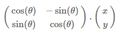

### Team number: 18

## Team members
- **Mostafa Amr**
- **Mostafa Abdelmohsen**
- **Adel Refaat**
- **Kirolos Dawood**

# Introduction 
In a classical description of nuclear magnetic resonance **(NMR)**, motion of a single "species" obeys the Bloch Equation.
The well-known solution of the Bloch Equation consists of T1 and T2 relaxation and precession. 
Bloch simulation is the most accurate way to study the effect of a pulse sequence on magnetization.

# Bulk magnetization vector 
The bulk magnetization vector is composed of the magnetic moments of many individual spins 
and its length has a maximum which is equal to the Boltzman excess population present at equilibrium, M0. 

#### An example figure for illustrating Bulk magnetization


<!--mri.beckman.illinois.edu/interactive/topics/contents/basic_concepts/figures/bulk.shtml-->

# Vector rotating function
We created a simple code using some common libraries to implement the function as follows:

- Using Numpy library we created the rotation matrix and bulk magnetization vector.
- Through the rotation matrix we rotated the magnetization vector around Z-axis.

# plotting the bulk magnetization's trajectory

## Literature

This part consists of three processes :

- Excitation
  - Rotation around Y-axis to lay the vector down from Z-axis to X-Y plane to be perpendicular on the Z-axis.
- Relaxation
   - After excitation we rotate the vector around the Z-axis again to superpose it again. 
- Repeat   

## Coding Libraries :

 We used Matplot library with the magnetization matrix to plot the trajectory then we created a rotation function for the vector.  


## Creating a rotating function 

```python
def rotMatrix(angle):
    c = np.cos(np.radians(angle))
    s = np.sin(np.radians(angle))
    return np.array([[c, -s], [s, c]])
```



# Bulk magnetization's trajectory 

This output will be shown after running **bloch equation.py**.


# Loading an image 
We loaded an image in some organized steps as follows:

- Reading the image as data using CV library. 
- CV library transformed it into some values in an array within the grey scale. 
- Using 'numpy' we implemented Fourier transform to this array then Fourier shift.     
- We used Fourier shift to handle the high and low frequencies.
            
#### Finally, we have a photo and its fourier transform, as shown in the figure below:

This output will be shown after running **Image-FFT.py**.


# Non-Uniformity Effect 
The non-uniformity effect of the magnetic field exposes only in the axial direction **(Z)**
while keeping it the same in the radial direction **(X or Y)**.
Using some random values and exposing them only in Z-axis and fixating the X-Y plane 
so the change will be only exposed in Z-direction we get:

#### 3D Implementation

This output will be shown after running **3D-Un uniform.py**.


#### 2D Implementation

This output will be shown after running **2D-Un uniform.py**.


